&nbsp;&nbsp;&nbsp;&nbsp;&nbsp;&nbsp;&nbsp;&nbsp;&nbsp;&nbsp;&nbsp;&nbsp;

 <!--
# Instagram Planner

The project was developed by me completely from scratch.

The application allows you to log into your Instagram account to schedule posts with subsequent notifications, edit and change the avatar / highlights. Add new custom icons to your profile, add colored circles to avatar or highlights, edit your profile information using custom fonts and copy them to the original Instagram.
  

&nbsp;&nbsp;&nbsp;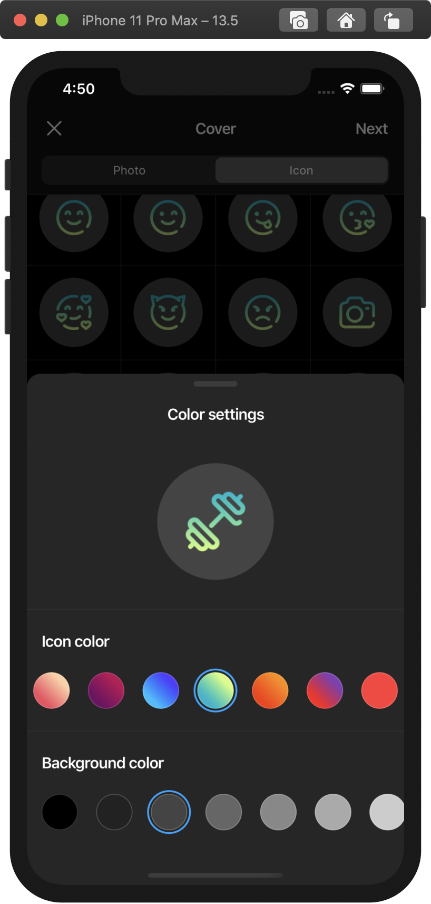&nbsp;&nbsp;&nbsp;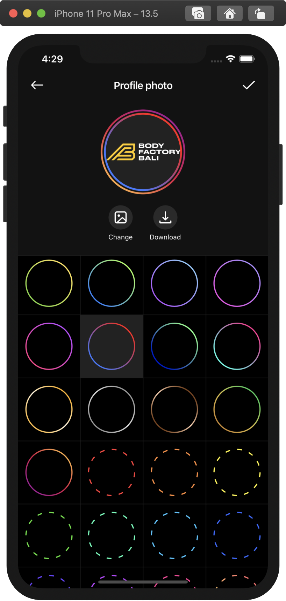&nbsp;&nbsp;&nbsp;  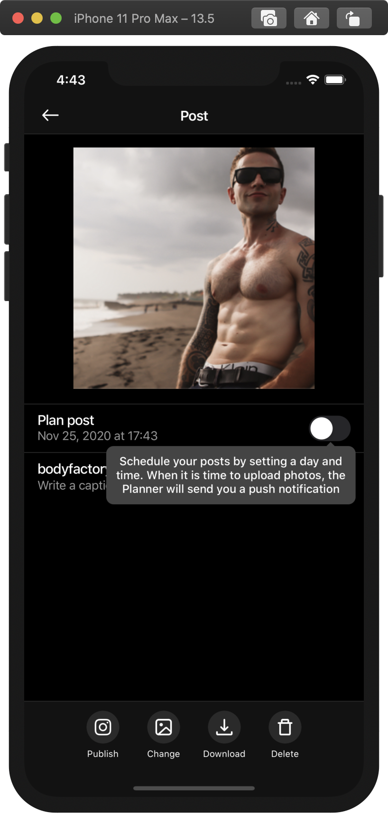&nbsp;&nbsp;&nbsp;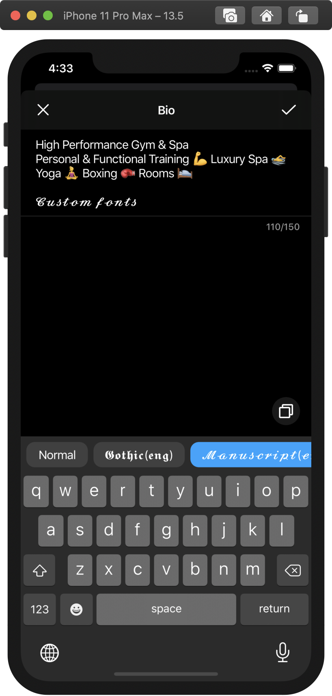&nbsp;&nbsp;&nbsp;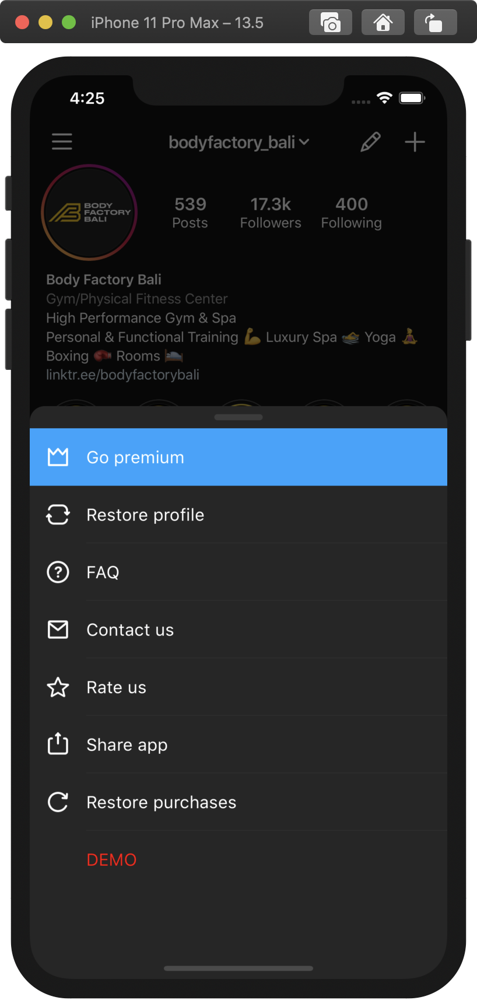  
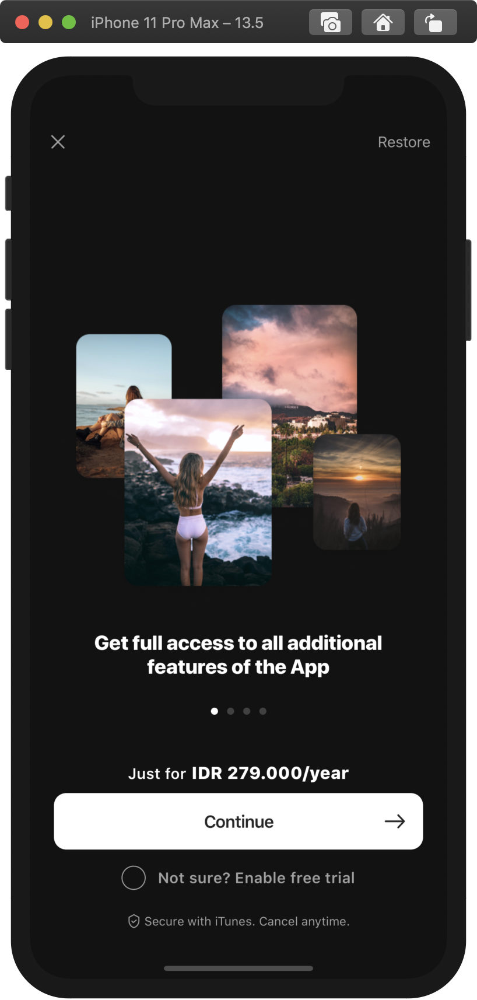

 

-->
  
<b>

To see all projects, contact me personally.

🔺 🔺 🔺

</b>
  

# Call Recorder

The project was not developed by me from scratch, but a lot of new logic and new screens was added by me.

This app allows you to record your phone call using service numbers. Sharing, editing and rearrange features are also possible.
  

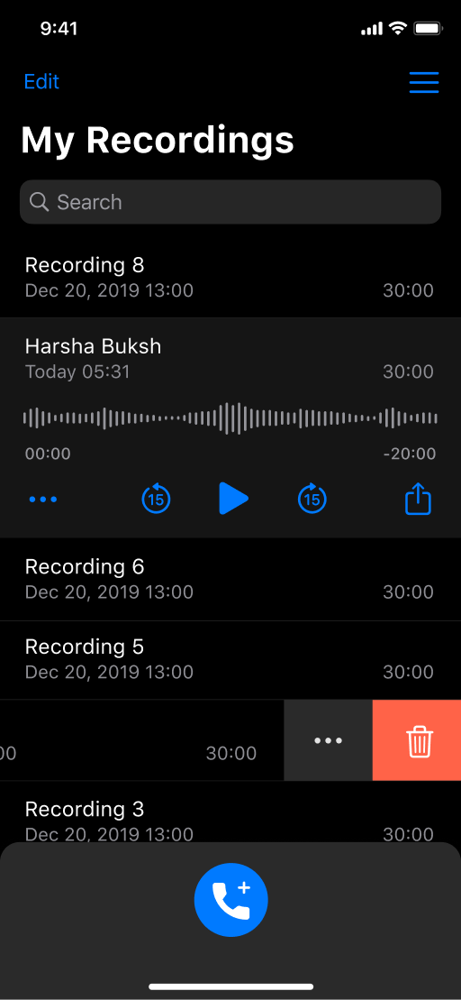&nbsp;&nbsp;&nbsp;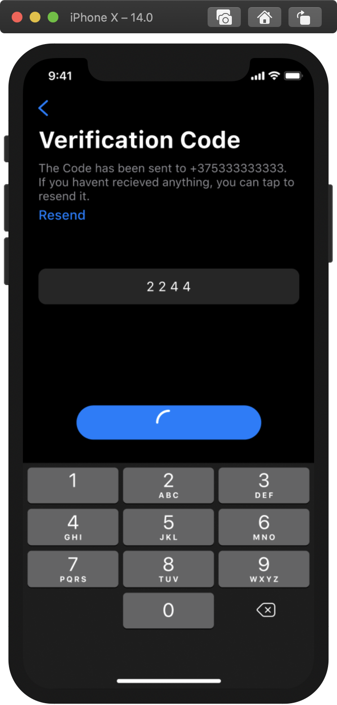  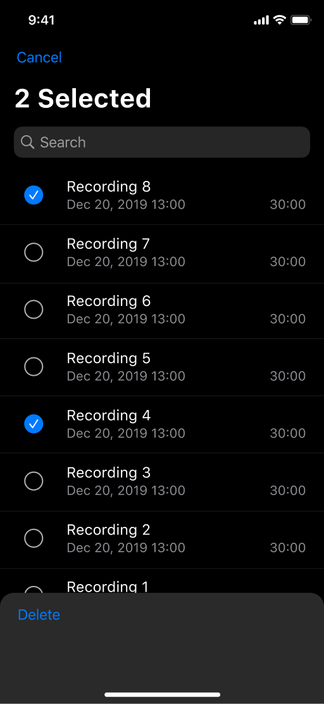&nbsp;&nbsp;&nbsp;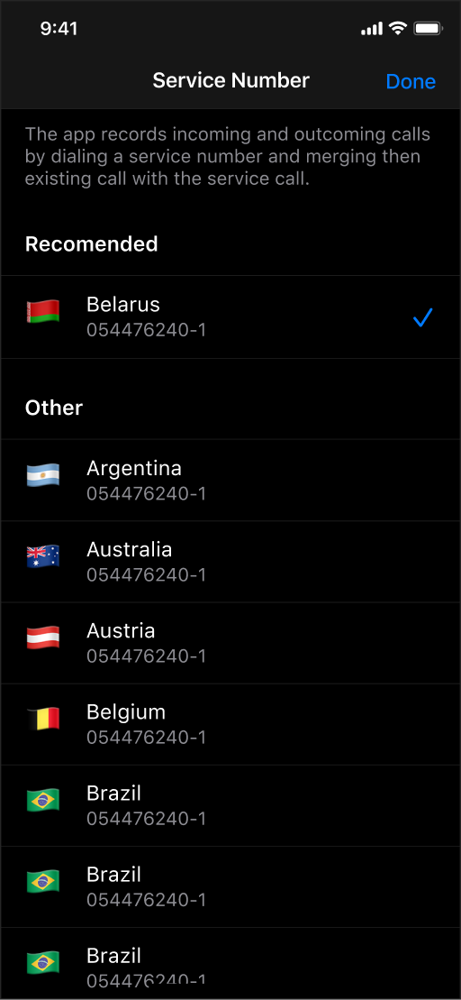  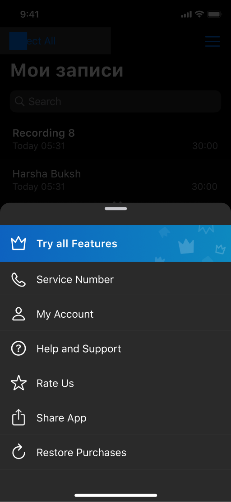

 

# Lighty, Presets for Lightroom

The project was not developed by me from scratch. Application for works in conjunction with Adobe Lightroom app. The user can view presets, add to favorites and share them, save to phone and open in Lightroom. "Today" screen - new presets are published every day, the "Presets" screen includes many presets categorized into groups.
  

&nbsp;&nbsp;&nbsp;  &nbsp;&nbsp;&nbsp;

 

# HERO: Intermittent Fasting App

This project developed by me from the scratch. The app collects data about the user (weight, height, exercise intensity, typical meal times) and based on this data, it offers personal plans for gaining muscle mass / losing weight. The project includes a lot of calculations, a flexible UI and a lot of push notifications.

  

&nbsp;&nbsp;&nbsp;&nbsp;&nbsp;&nbsp;&nbsp;&nbsp;&nbsp;  &nbsp;&nbsp;&nbsp;&nbsp;&nbsp;&nbsp;  
&nbsp;&nbsp;&nbsp;

 

# Widgets Themes - Color Widgets

The project was not developed by me from scratch, but a lot of new logic and new screens was added by me. The application allows you to install custom widgets (iOS 13).
All project was written using SwiftUI.

  

&nbsp;&nbsp;&nbsp;  &nbsp;&nbsp;&nbsp;

 

# EGO VPN

This app is one of a series of VPN applications that I have been working on from the very beginning to the end. In addition to the functionality that allows you to be online incognito, a user-friendly interface was implemented, smooth transitions between scenes and animations.
  

&nbsp;&nbsp;&nbsp;&nbsp;&nbsp;&nbsp;

 

# Document Scanner

This application includes many features that allow you to scan documents and edit them. Among the main features are scanning, applying various filters, resizing / quality and resolution. So there are such functions as text recognition, signature and many others...
  

&nbsp;&nbsp;&nbsp;&nbsp;&nbsp;&nbsp;&nbsp;&nbsp;&nbsp;&nbsp;&nbsp;&nbsp;&nbsp;&nbsp;&nbsp;&nbsp;&nbsp;&nbsp;&nbsp;&nbsp;&nbsp;&nbsp;&nbsp;&nbsp;&nbsp;&nbsp;&nbsp;&nbsp;&nbsp;&nbsp;&nbsp;&nbsp;&nbsp;&nbsp;&nbsp;&nbsp;&nbsp;&nbsp;&nbsp;&nbsp;&nbsp;&nbsp;&nbsp;&nbsp;&nbsp;&nbsp;&nbsp;&nbsp;

 

# Secure VPN Pro 
  
Nice and minimal design was implemented in this application. Ease of use when choosing a server, connecting with a user-friendly interface make this application as comfortable as possible.

This app is implemented in such a way as to be responsive and simple. Also, as soon as VPN connection has been established you can observe new network parameters such as ping and ip-address.

&nbsp;&nbsp;&nbsp;&nbsp;&nbsp;&nbsp;&nbsp;&nbsp;&nbsp;&nbsp;&nbsp;&nbsp;&nbsp;&nbsp;&nbsp;&nbsp;

 

 <!--

In this application, I implemented a fun and simple design along with the basic functionality that allows you to be incognito on the network.

Nice colors, animations and simplicity make this app comfortable and user-friendly.

&nbsp;&nbsp;&nbsp;&nbsp;&nbsp;&nbsp;&nbsp;&nbsp;&nbsp;&nbsp;&nbsp;&nbsp;&nbsp;&nbsp;&nbsp;&nbsp;

# Hot VPN

Nice and minimal design was implemented in this application. Ease of use when choosing a server, connecting with a user-friendly interface make this application as comfortable as possible.

This app is implemented in such a way as to be responsive and simple. Also, as soon as VPN connection has been established you can observe new network parameters such as ping and ip-address.

&nbsp;&nbsp;&nbsp;&nbsp;&nbsp;&nbsp;&nbsp;&nbsp;&nbsp;&nbsp;&nbsp;&nbsp;&nbsp;&nbsp;&nbsp;&nbsp;

 
-->
